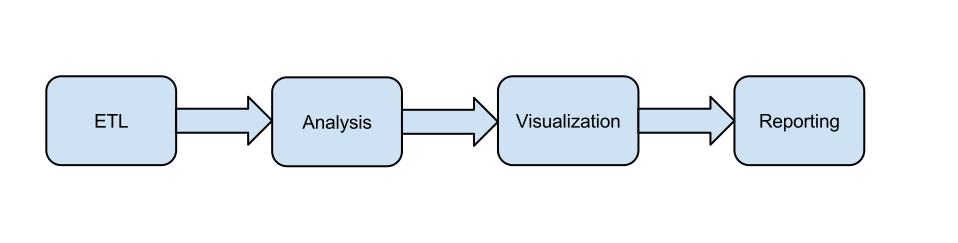
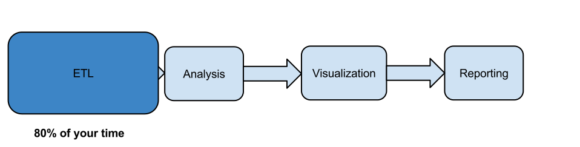

## Assumptions

> + You have R installed
> + You know some basics of R 
    + Creating variables
    + Creating basic graphs
    + Running some analyses
> + You may or may not have programming experience
> + You love playing with data

--- 
## Objective

### To get you started using R for a data analysis workflow



--- 
## Objective

### To get you started using R for a data analysis workflow



---.segue .dark
## Background

---
## Some background knowledge

+ R as a calculator
+ Ingesting data
  + `read.table`, `read.csv`
+ Types of data
  + numeric, integer, character, Date
  + vector, matrix, array, list, **data.frame**
+ Base graphics
  + plot, points, lines
  + xlab, ylab
  + par (col, cex, ...)
  + mfrow

---
## Some background knowledge

+ Export graphs
  + png, svg, pdf, jpeg
+ Some statistics
  + `mean`, `median`, `summary`
  + `t.test`, `wilcox.text`, `lm`

---
## Launching pad

We will take off from here:

+ More functionality of R
+ Introduction to the R package ecosystem
+ "Best" practices (or rather, my practices)
+ Tips and Tricks
+ Resources

--- .quote .nobackground .segue .dark

<q> The question is not if R can do it, but how</q>
<p style="text-align:right;"> -- Douglas Bates </p>

--- .segue .dark
## ETL (Extract, Transform, Load)

--- .segue .dark
## Extract

---

## Reading data into R

The workhorse for reading _tabular_ data is `read.table`

```r
args(read.table)
```

```
## function (file, header = FALSE, sep = "", quote = "\"'", dec = ".", 
##     row.names, col.names, as.is = !stringsAsFactors, na.strings = "NA", 
##     colClasses = NA, nrows = -1, skip = 0, check.names = TRUE, 
##     fill = !blank.lines.skip, strip.white = FALSE, blank.lines.skip = TRUE, 
##     comment.char = "#", allowEscapes = FALSE, flush = FALSE, 
##     stringsAsFactors = default.stringsAsFactors(), fileEncoding = "", 
##     encoding = "unknown", text) 
## NULL
```


### Too much information!!!

You can find explanations for all the arguments by using `?read.table`

*** pnotes

This is an example of a `function` in R. Functions have _arguments_, and you
can set default values for several of the arguments

The help system can be accessed using `?read.table` or `help(read.table)`

---

## Reading data into R


```r
BP <- read.table("data/bpdata.csv", header = T, sep = ",")
head(BP)
```

```
##   X X.1    sex sbp dbp snp1 snp2 snp3 snp4 snp5 snp6 snp7 snp8 snp9 snp10
## 1 1   1 FEMALE 171  89   CC   TT   TT   TT   CC   GG   AA   TT   TT    CC
## 2 2   2   MALE 160  99   TT   TT   CC <NA>   CC   AG   AT   CC   CT    CC
## 3 3   3 FEMALE 142  83   CT   TT   TC   CT   CC   AG   TT   CC   TT    CT
## 4 4   4   MALE 126  71   CT   TT   CC <NA>   CC   AA   TT   CC   TT    CT
## 5 5   5 FEMALE 126  82   CT   TT   CC   CC   CC   AA   TT   CC   TT    CT
## 6 6   6 FEMALE 132  89   CT   TT   CC   CC   CC <NA>   TT   CC   TT    TT
##   snp11 bmi
## 1    TT  25
## 2    CT  35
## 3    TT  34
## 4    CT  32
## 5    CT  34
## 6    CT  25
```


---
## Reading data into R


```r
BP <- read.table("data/bpdata.csv", header = T, sep = ",")
head(BP)
```


```r
BP <- read.csv("data/bpdata.csv")
```


These functions are for tabular data stored in text files (even on the web!)

Let's get monthly S&P data between April 1, 1999 and April 1, 2009


```r
sp500 <- read.csv(paste("http://ichart.finance.yahoo.com/table.csv?s=%5EGSPC&a=03&b=1&c=1999&d=03&e=1&f=2009&g=m&ignore=.csv"))
head(sp500, n = 3)
```

```
##         Date  Open  High   Low Close    Volume Adj.Close
## 1 2009-04-01 793.6 813.6 783.3 811.1 1.207e+10     811.1
## 2 2009-03-02 729.6 833.0 666.8 797.9 7.633e+09     797.9
## 3 2009-02-02 823.1 875.0 734.5 735.1 7.022e+09     735.1
```


---
## Reading from databases


```r
library(RODBC)  # Calling a package names RODBC
con <- odbcConnect("MCT4")
sqlTables(con)
```

```
##   TABLE_CAT TABLE_SCHEM TABLE_NAME TABLE_TYPE REMARKS
## 1      <NA>        <NA>     Sheet1      TABLE    <NA>
```

```r
dat <- sqlFetch(con, "Sheet1")
head(dat[, 1:4])
```

```
##   patid         Spec No  Age             Race
## 1    NA            <NA> <NA>             <NA>
## 2     1        s03-6643   62 african american
## 3     2       S98-16845   70            white
## 4     3 S00-10987 re-ex   43 african american
## 5    NA     S00-07663 p   43 african american
## 6     4       S99-22161   54            white
```

```r
odbcClose(con)
```


---
## Reading from databases

On Windows, you can directly read from Excel files (often the quickest, most accurate method)

```r
library(RODBC)
con <- odbcConnectExcel(xls.file="C:/folder/data/myfile.xls")
dat1 <- sqlFetch(con, 'Sheet1')
odbcClose(con)
```

You can also connect to MySQL (`RMySQL`), SQLite (`RSQLite`), PostgreSQL (`RPostgreSQL`)

Connections are also now available to Oracle, SAP, Teradata (use `Google`)

> `RMySQL` under Windows is not straightforward. Use the advice available 
  [here](http://stackoverflow.com/questions/9441527/rmysql-windows-7-home-installation-error)

---


